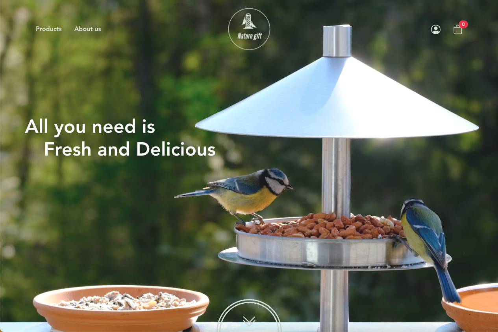

# Nature Gift - Vue Ecommerce Website


## Table of contents

- [Overview](#overview)
  - [The challenge](#the-challenge)
  - [Screenshot](#screenshot)
  - [Links](#links)
- [My process](#my-process)
  - [Built with](#built-with)
  - [What I learned](#what-i-learned)
  - [Continued development](#continued-development)
  - [Useful resources](#useful-resources)
- [Author](#author)

## Overview

### The challenge

Users should be able to:

Front
- Sign in to the administration
- Products
  - Check informations from individual products
- Cart
  - Add products to the cart
  - Edit products to the cart
  - Delete products to the cart
- Coupons
  - Apply coupons
- Orders
  - Post orders

Admin
- Log out from the administration
- Products
  - Get products from the server
  - Add new products
  - Edit individual products
  - Delete individual products
- Orders
  - Get orders from the server
  - Edit individual orders
  - Delete individual orders
  - Delete all orders
- Coupons
  - Get coupons from the server
  - Add new coupons
  - Edit individual coupons
  - Delete individual coupons
- Articles
  - Get articles from the server
  - Add new articles
  - Edit individual articles
  - Delete individual articles

### Screenshot
 

### Links

- [Solution URL](https://github.com/TimmyLin21/naturegift)
- [Live Site URL](https://timmylin21.github.io/naturegift/#/)

## My process

### Built with

- HTML5 
- CSS3
- Bootstrap
- Scss
- Vue
- Vue Cli
- Vue Router
- Git

### What I learned

Playsinline attribute in <video> tag allows the mobile browser play the video right where it is instead of opening it up with fullscreen. 
```html
<video class="w-100" autoplay loop muted playsinline>
  <source src="../assets/video/fresh-and-delicious.mp4" type="video/mp4">
</video>
```
Add the horizontal lines besides header with flexbox. 
```html
<h2 class="mb-4 text-secondary d-flex justify-content-between align-items-center">
  <b class="d-block h-2 bg-primary flex-grow-1"></b>
  <span class="mx-4">See why customers love our products</span>
  <b class="d-block h-2 bg-primary flex-grow-1"></b>
</h2>
```
Set input with 100% width in order to make sure input won't expands outside the td.
```html
<td width="10%">
  <input type="number" min="0" value="1" class="w-100">
</td>
```
The class of body should be 100vh and overflow-hidden while loading, otherwise light-box won't be the same height as body.
```js
this.$emitter.on('loading-state', (state) => {
  this.isLoading = state;
  const body = document.querySelector('body');
  if (state) {
    window.scrollTo(0, 0);
    body.setAttribute('class', 'mh-100vh overflow-hidden');
  } else {
    body.setAttribute('class', '');
  }
});
```
Most common way to monitor the height of the viewport is adding an event listener on window. You can also use watch to catch the height, but remember to apply $nextTick() method otherwise the height which you recieve will be the same.
```js
export default {
  data() {
    return {
      isTop: true,
    };
  },
  methods: {
    scrollHeight() {
      const scrollPosition = document.documentElement.scrollTop;
      if (scrollPosition <= 150) {
        this.isTop = true;
      } else {
        this.isTop = false;
      }
    },
  },
  mounted() {
    document.addEventListener('scroll', this.scrollHeight);
  },
};
```
Repeated scripts such as modal can be written in mixin and then import to whatever components you want. It helps you organise your code and reduce the time repeating.
```js
import modalMixin from '@/mixins/modalMixin';

export default {
  mixins: [modalMixin],
};
```
In order to transform the value to the date form (YYYY-MM-DD) in 'date input' from timestamp or vice versa, Date object and its methods are necessary.
```js
watch: {
  coupon() {
    this.cacheCoupon = this.coupon;
    // transform to YYYY-MM-DD from timestamp
    const date = new Date(this.cacheCoupon.due_date * 1000).toISOString().split('T');
    [this.due_date] = date;
  },
  due_date() {
    this.cacheCoupon.due_date = Math.floor(new Date(this.due_date) / 1000);
  },
},
```
Use String.prototype.localeCompare to sort strings in objects.
```js
this.allProducts.sort((x, y) => (x.title).localeCompare(y.title));
```


### Continued development

It's my first time to design the whole website, therefore there is still room for improvement in UI and UX. Besides, there are some plugins which I haven't used before such as ckeditor and veevalidate. I need more practice to get more familiar with them. Also, I've learned a lot in organizing project like mixins and scripts which I believe it's gonna be helpful for my future complex projects.

### Useful resources

- [What does 'playsinline' mean in web video](https://css-tricks.com/what-does-playsinline-mean-in-web-video/) - A simple and clear article explains how 'playsinline' attribute works in the video tag.
- [Create a Website With Video Background](https://www.youtube.com/watch?v=8MgpE2DTTKA&ab_channel=TraversyMedia) - Create a beautiful, custom landing page for a Travel website using HTML, CSS and a little JavaScript.
- [Minimal animated pure css menu icon](https://codepen.io/fromwireframes/pen/arMrYp) - Animated menu icon demo code.


## Author

- Git - [Tim](https://github.com/TimmyLin21)
- Frontend Mentor - [@TimmyLin21](https://www.frontendmentor.io/profile/TimmyLin21)
